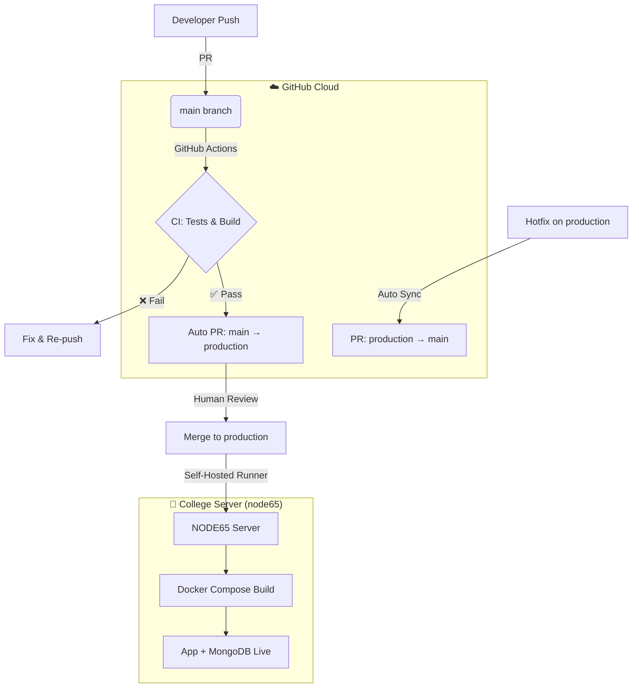

# 📈 MarketWatch — Financial Social Media Platform

A full-stack social media platform for financial discussions, featuring real-time stock tracking, AI-powered smart search, Google OAuth, and an automated CI/CD pipeline with Docker deployment.

**Live at:** `https://node65.cs.colman.ac.il`

---

## 🚀 Features

### 📱 Application
| Feature | Description |
|---|---|
| **User Authentication** | JWT-based auth with access + refresh tokens, Google OAuth 2.0 |
| **Social Feed** | Create, read, update, delete posts with image uploads |
| **Comments & Likes** | Full CRUD comments, like/unlike with duplicate prevention |
| **User Profiles** | Profile management with avatar upload |
| **Stock Watchlist** | Track stocks and monitor price changes |
| **Price Alerts** | Set target price alerts with real-time status |
| **AI Smart Search** | Google Gemini-powered financial analysis and intelligent search |
| **Responsive Frontend** | React + Vite SPA with Bootstrap UI |

### 🔒 Security
- JWT access + refresh token rotation
- Password hashing with bcrypt
- Ownership validation on all protected operations
- File upload restrictions (images only, 5MB limit)
- Helmet security headers & rate limiting
- HTTPS with SSL/TLS (Nginx reverse proxy)

---

## 🛠 Tech Stack

| Layer | Technology |
|---|---|
| **Frontend** | React 18, TypeScript, Vite, Bootstrap |
| **Backend** | Node.js, Express.js, TypeScript |
| **Database** | MongoDB with Mongoose ODM |
| **AI** | Google Gemini API |
| **Auth** | JWT + Passport.js (Google OAuth 2.0) |
| **Testing** | Jest + Supertest |
| **DevOps** | Docker, Docker Compose, GitHub Actions, Nginx |
| **Server** | Ubuntu 24.04 LTS (Self-hosted runner on college server) |

---

## 📦 Quick Start

### Prerequisites
- Node.js v20+
- Docker & Docker Compose
- MongoDB (local or Docker)
- Google Gemini API key

### Local Development

```bash
# 1. Clone
git clone https://github.com/ShimiManashirov/MarketWatchWeb.git
cd MarketWatchWeb

# 2. Install dependencies
npm install
cd client && npm install && cd ..

# 3. Configure environment
cp .env.example .env   # Edit with your values

# 4. Start with Docker
docker compose up --build -d

# 5. Or start without Docker
npm run dev             # Backend on :3000
cd client && npm run dev  # Frontend on :5173
```

### Environment Variables

| Variable | Description | Required |
|---|---|---|
| `MONGO_URI` | MongoDB connection string | ✅ |
| `JWT_SECRET` | Secret for access tokens | ✅ |
| `REFRESH_TOKEN_SECRET` | Secret for refresh tokens | ✅ |
| `GEMINI_API_KEY` | Google Gemini API key | ✅ |
| `GOOGLE_CLIENT_ID` | Google OAuth client ID | ✅ |
| `GOOGLE_CLIENT_SECRET` | Google OAuth client secret | ✅ |
| `GOOGLE_CALLBACK_URL` | Google OAuth callback URL | ✅ |
| `CLIENT_URL` | Frontend URL for CORS & redirects | ✅ |
| `PORT` | Server port (default: 3000) | ❌ |

---

## 🧪 Testing

```bash
# Run all tests (46 tests)
npm test

# Run specific suites
npm test -- auth.test.ts      # 7 auth tests
npm test -- user.test.ts      # 4 user profile tests
npm test -- post.test.ts      # 19 post + like tests
npm test -- comment.test.ts   # 13 comment tests
npm test -- ai.test.ts        # 3 AI tests
```

---

## 📚 API Documentation

Swagger UI is available at `/api-docs` when the server is running.

### Endpoints

| Route | Methods | Description |
|---|---|---|
| `/auth/register` | POST | Register new user |
| `/auth/login` | POST | Login, returns JWT tokens |
| `/auth/logout` | POST | Invalidate refresh token |
| `/auth/refresh` | POST | Refresh access token |
| `/auth/google` | GET | Initiate Google OAuth |
| `/auth/google/callback` | GET | Google OAuth callback |
| `/user/profile` | GET | Get current user profile |
| `/user/update` | PUT | Update profile |
| `/posts` | GET, POST | List/create posts |
| `/posts/:id` | GET, PUT, DELETE | Read/update/delete post |
| `/posts/:id/like` | POST, DELETE | Like/unlike post |
| `/posts/:postId/comments` | GET, POST | List/create comments |
| `/comments/:id` | PUT, DELETE | Update/delete comment |
| `/ai/analyze` | POST | AI financial analysis |
| `/ai/search` | POST | Smart search with keyword extraction |
| `/stocks/search` | GET | Search stocks |
| `/watchlist` | GET, POST, DELETE | Manage watchlist |

---

## 🔄 CI/CD & DevOps Architecture

We use a **Lean Deployment Strategy** designed for a resource-constrained college server. Heavy CI runs in the GitHub Cloud; only deployment runs on the server.

### 🌊 Branching Strategy

| Branch | Purpose | Trigger |
|---|---|---|
| `main` | Development & CI | PRs trigger test suite |
| `production` | Live deployment | Push triggers Docker deploy |
| `feature/*` | New features | PR to `main` |
| `fix/*` | Bug fixes | PR to `main` |

### 🛠 Automated Pipeline



### 📋 Workflow Files

| File | Trigger | Runs On | Purpose |
|---|---|---|---|
| `ci.yml` | PR to `main` | `ubuntu-latest` | Run tests & build verification |
| `main-to-prod-pr.yml` | Push to `main` | `ubuntu-latest` | Auto-create PR to `production` |
| `deploy-prod.yml` | Push to `production` | `self-hosted` (NODE65) | Docker build & deploy |
| `sync-main.yml` | Push to `production` | `ubuntu-latest` | Sync hotfixes back to `main` via PR |

### 🏗 Infrastructure

```
                    ┌──────────────────────────────────┐
                    │      College Server (NODE65)      │
                    │      Ubuntu 24.04 LTS             │
                    │                                    │
  HTTPS (443) ─────►│  Nginx (Reverse Proxy + SSL)      │
                    │       │                            │
                    │       ▼                            │
                    │  Docker Compose                    │
                    │  ┌─────────────────────────────┐  │
                    │  │ market_watch_app (:3000)     │  │
                    │  │ Node.js + Express + React    │  │
                    │  └──────────┬──────────────────┘  │
                    │             │                      │
                    │  ┌──────────▼──────────────────┐  │
                    │  │ market_watch_db (:27017)     │  │
                    │  │ MongoDB (with named volume)  │  │
                    │  └─────────────────────────────┘  │
                    │                                    │
                    │  GitHub Actions Runner (service)   │
                    └──────────────────────────────────┘
```

### 🔑 Key Design Decisions

1. **Cloud-First Testing** — All 46 tests run on GitHub's infrastructure, not the college server. This saves server resources for the live application.

2. **Self-Hosted Runner as Service** — Installed via `systemd`, the runner starts automatically on server reboot. No manual intervention needed.

3. **Named Docker Volumes** — MongoDB data persists in `mongo_data` volume. `docker compose down` does NOT delete volumes, so **data survives redeployments**.

4. **Hotfix Loop Protection** — The sync workflow detects when a push to `production` originated from `main` and skips the reverse sync, preventing infinite PR loops.

5. **Manual Merge Gate** — All production deployments require a human to merge the PR, providing total control for demos and presentations.

---

## 📁 Project Structure

```
MarketWatchWeb/
├── .github/workflows/       # CI/CD pipeline definitions
│   ├── ci.yml               # Test & build on PR
│   ├── deploy-prod.yml      # Docker deploy on production push
│   ├── main-to-prod-pr.yml  # Auto PR main → production
│   └── sync-main.yml        # Hotfix sync production → main
├── client/                   # React frontend (Vite)
│   ├── src/
│   │   ├── components/      # React components
│   │   ├── pages/           # Page components
│   │   └── services/        # API service layer
│   └── dist/                # Production build output
├── src/                      # Express backend
│   ├── controllers/         # Request handlers
│   ├── models/              # Mongoose schemas
│   ├── routes/              # API route definitions
│   ├── middleware/          # Auth & file upload middleware
│   ├── services/            # Business logic (Gemini AI, Cron)
│   ├── config/              # Passport OAuth config
│   ├── tests/               # Jest test suites
│   ├── app.ts               # Express app setup
│   └── server.ts            # Server entry point
├── nginx/                    # Nginx reverse proxy config
├── Dockerfile               # Multi-stage Docker build
├── docker-compose.yml       # Container orchestration
├── setup_runner.sh          # Server runner installation script
└── .env                     # Environment variables (not in git)
```

---

## 👥 Authors

- **Shimi Manashirov** — [@ShimiManashirov](https://github.com/ShimiManashirov)
- **Tamir Shoval** — [@Tamir26](https://github.com/Tamir26)

## 🙏 Acknowledgments

- Google Gemini AI for intelligent search capabilities
- College of Management (Colman) — CS Faculty for server infrastructure
- Express.js & React communities

---

**Built with ❤️ for financial discussions | Colman CS — Internet Systems Development**
