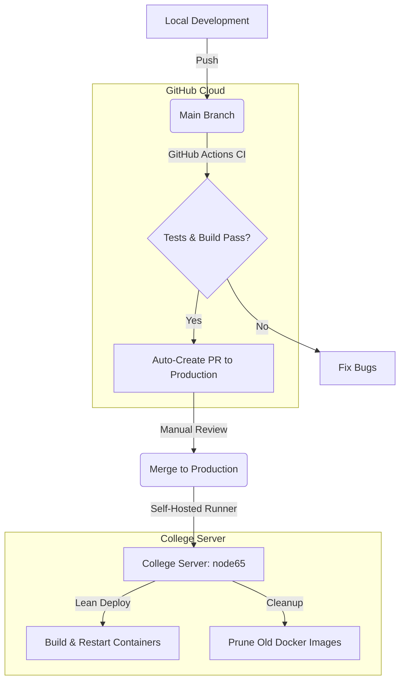

# MarketWatchWeb - Financial Social Media Platform

A full-featured social media backend for financial discussions with AI-powered smart search, built with Node.js, TypeScript, Express, and MongoDB.

## 🚀 Features

### Core Features
- ✅ **User Authentication** - Secure registration, login, logout with JWT
- ✅ **User Profiles** - Profile management with image upload
- ✅ **Posts** - Create, read, update, delete posts with images
- ✅ **Likes** - Like/unlike posts with duplicate prevention
- ✅ **Comments** - Full CRUD operations on post comments
- ✅ **AI Smart Search** - Gemini-powered financial analysis and intelligent search

### Security
- 🔒 JWT-based authentication with refresh tokens
- 🔒 Password hashing with bcrypt
- 🔒 Ownership validation on all protected operations
- 🔒 File upload restrictions (images only, 5MB limit)
- 🔒 Input validation and sanitization

## 📊 Test Coverage

**50 tests, all passing ✅**
- 7 Authentication tests
- 4 User profile tests
- 19 Post tests (including likes)
- 13 Comment tests
- 7 AI tests (with mocked Gemini service)

## 🛠️ Tech Stack

- **Runtime**: Node.js with TypeScript
- **Framework**: Express.js
- **Database**: MongoDB with Mongoose
- **Authentication**: JWT (jsonwebtoken)
- **AI**: Google Gemini API
- **File Upload**: Multer
- **Testing**: Jest + Supertest
- **Password Hashing**: bcryptjs

## 📦 Installation

### Prerequisites
- Node.js (v14 or higher)
- MongoDB (running locally or remote)
- Google Gemini API key (for AI features)

### Setup

1. **Clone the repository**
   ```bash
   git clone https://github.com/ShimiManashirov/MarketWatchWeb.git
   cd MarketWatchWeb
   ```

2. **Install dependencies**
   ```bash
   npm install
   ```

3. **Configure environment variables**
   
   Create a `.env` file in the root directory:
   ```env
   MONGO_URI=mongodb://127.0.0.1:27017/market_watch_db
   JWT_SECRET=your-secret-key-here
   REFRESH_TOKEN_SECRET=your-refresh-secret-here
   GEMINI_API_KEY=your-gemini-api-key-here
   PORT=3000
   ```

4. **Build the project**
   ```bash
   npm run build
   ```

5. **Run tests**
   ```bash
   npm test
   ```

6. **Start the server**
   ```bash
   npm run dev
   ```

   The server will start on `http://localhost:3000`

## 📚 API Documentation

### Authentication (`/auth`)
- `POST /auth/register` - Register new user
- `POST /auth/login` - Login and get tokens
- `POST /auth/logout` - Logout (invalidate refresh token)
- `POST /auth/refresh` - Refresh access token

### User (`/user`)
- `GET /user/profile` - Get current user profile
- `PUT /user/update` - Update profile (username, image)

### Posts (`/posts`)
- `POST /posts` - Create post
- `GET /posts` - Get all posts
- `GET /posts/:id` - Get specific post
- `GET /posts/owner/:ownerId` - Get posts by user
- `GET /posts/my-posts` - Get current user's posts
- `PUT /posts/:id` - Update post (owner only)
- `DELETE /posts/:id` - Delete post (owner only)
- `POST /posts/:id/like` - Like a post
- `DELETE /posts/:id/like` - Unlike a post

### Comments
- `POST /posts/:postId/comments` - Create comment
- `GET /posts/:postId/comments` - Get all comments for post
- `PUT /comments/:id` - Update comment (owner only)
- `DELETE /comments/:id` - Delete comment (owner only)

### AI Features (`/ai`)
- `POST /ai/analyze` - Analyze financial query with AI
- `POST /ai/search` - Smart search with keyword extraction
- `POST /ai/suggestions` - Generate post title suggestions
- `GET /ai/analyze-post/:postId` - Analyze post sentiment and topics

## 📖 Detailed Documentation

- [POST_API.md](./POST_API.md) - Posts and likes documentation
- [COMMENT_API.md](./COMMENT_API.md) - Comments documentation
- [AI_API.md](./AI_API.md) - AI features documentation

## 🧪 Testing

Run all tests:
```bash
npm test
```

Run specific test suite:
```bash
npm test -- auth.test.ts
npm test -- post.test.ts
npm test -- comment.test.ts
npm test -- ai.test.ts
```

## 📁 Project Structure

```
MarketWatchWeb/
├── src/
│   ├── controllers/      # Request handlers
│   │   ├── auth_controller.ts
│   │   ├── user_controller.ts
│   │   ├── post_controller.ts
│   │   ├── comment_controller.ts
│   │   └── ai_controller.ts
│   ├── models/          # Database schemas
│   │   ├── user_model.ts
│   │   ├── post_model.ts
│   │   └── comment_model.ts
│   ├── routes/          # API routes
│   │   ├── auth_routes.ts
│   │   ├── user_routes.ts
│   │   ├── post_routes.ts
│   │   ├── comment_routes.ts
│   │   └── ai_routes.ts
│   ├── middleware/      # Custom middleware
│   │   ├── auth_middleware.ts
│   │   └── file_middleware.ts
│   ├── services/        # Business logic
│   │   └── gemini_service.ts
│   ├── tests/           # Test files
│   │   ├── auth.test.ts
│   │   ├── user.test.ts
│   │   ├── post.test.ts
│   │   ├── comment.test.ts
│   │   └── ai.test.ts
│   ├── app.ts           # Express app setup
│   └── server.ts        # Server entry point
├── .env                 # Environment variables
├── .gitignore          # Git ignore rules
├── package.json        # Dependencies
├── tsconfig.json       # TypeScript config
└── jest.config.ts      # Jest config
```

## 🔑 Getting a Gemini API Key

1. Visit [Google AI Studio](https://makersuite.google.com/app/apikey)
2. Sign in with your Google account
3. Click "Create API Key"
4. Copy the key and add it to your `.env` file

## 🚀 Deployment

### Environment Variables for Production
Make sure to set these in your production environment:
- `MONGO_URI` - Your MongoDB connection string
- `JWT_SECRET` - Strong secret for access tokens
- `REFRESH_TOKEN_SECRET` - Strong secret for refresh tokens
- `GEMINI_API_KEY` - Your Gemini API key
- `PORT` - Server port (default: 3000)

### Build for Production
```bash
npm run build
npm start
```

## 🔄 CI/CD & Deployment Flow

We use a **Lean Deployment Strategy** designed for the college server (`node65`). This flow ensures high code quality while minimizing server resource usage.

### 🌊 Branching Strategy
- **`main`**: Development branch. All logic tests and builds are verified here in the GitHub Cloud.
- **`production`**: Live branch. Only tested, production-ready code is merged here.

### 🛠️ Automated Workflow Diagram



### 🚀 Key Features
1. **Cloud-First Testing**: Heavy logic tests run on GitHub's infrastructure, not the college server.
2. **Self-Hosted Runner**: The server securely "calls" GitHub for updates; no open inbound ports required.
3. **Automatic Sync**: Hotfixes pushed directly to `production` are automatically synced back to `main`.
4. **Manual Gate**: All production deployments require a human to merge the PR, providing total control for presentations.

---

## 🤝 Contributing

1. Fork the repository
2. Create a feature branch (`git checkout -b feature/amazing-feature`)
3. Commit your changes (`git commit -m 'Add amazing feature'`)
4. Push to the branch (`git push origin feature/amazing-feature`)
5. Open a Pull Request

## 📝 License

This project is licensed under the ISC License.

## 👤 Author

**Shimi Manashirov**
- GitHub: [@ShimiManashirov](https://github.com/ShimiManashirov)

## 🙏 Acknowledgments

- Google Gemini AI for intelligent search capabilities
- Express.js community
- MongoDB team
- All contributors

---

**Built with ❤️ for financial discussions**
